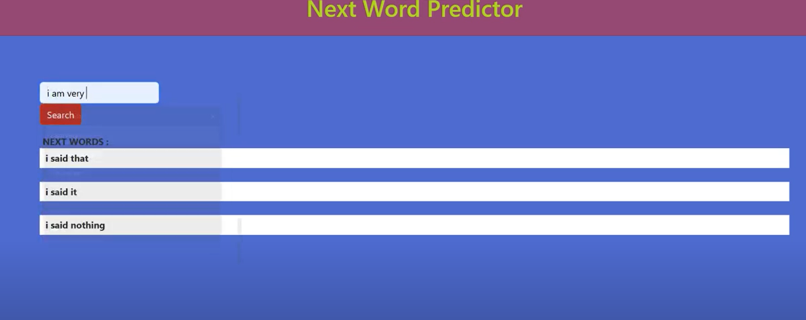
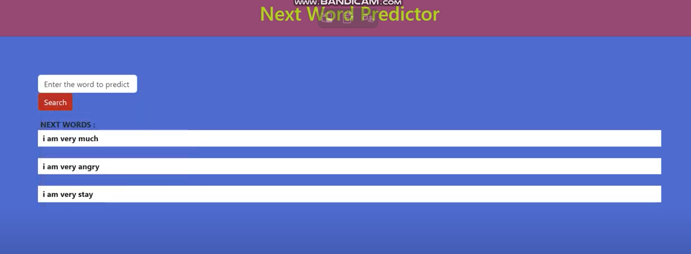

# 💳 Next Words Predictors- 
A Interactive Web App that predict three possible next words to complete that sentences.

# Demo Pictures 




# Yt Video Link 
[Watch the demo on YouTube](https://www.youtube.com/watch?v=6kmy_ETX_Ic)

## 📑 Table of Contents
- [Project Overview](#project-overview)
- [Dataset](#dataset)
- [Tools & Technologies](#tools--technologies)
- [Project Structure](#project-structure)
- [How to start](#How-to-Start)

---

## 🔹Project Overview
The goal of this project to create a web app to predict the next three words using LSTM.
---

## 🔹Dataset
- Source of the dataset :  `1661-0.txt`

- This is ebook of story of Sherlock Holmes.

## 🔹Tools & Technologies
- Python 
- LSTM
- Numpy 
- Pandas 
- Matplotlib
- tensorflow
- keras 
---
## 🔹Project Structure
```
NextWordPredictor/
├── UserInternface.py                 # Main Streamlit application
├── 1660-0.txt                       # raw text data
├── nextWordPredictionUsingLstm.ipynb      # LSTM Model Training 
├── requirements.txt           # Install Dependencies
├── test/                   # to test it 
├── README.md            # This file for overview
├── tokenizer.pkl         # this is tokenizer to convert into text - embedding 
│
└── .gitignore      # do not consider the virtual environments
```
---
## 🔹How to Start 

1. create a virtual environment and activate it .
```bash
python -m venv <environment-name>
myenv\Scripts\activate
```
2. clone the repository
```bash
git clone https://github.com/Sachin2095/NextWordPredictor.git 
```
3. Install Dependencies
```bash
pip install -r requirements.txt
```
4. Run the notebook  `nextWordPredictionUsingLstm.ipynb`
   
5. Open the App Using `UserInternface.py`

6. Open Browser and go to Local Host
   ```bash
   http://localhost:5000
   ```


